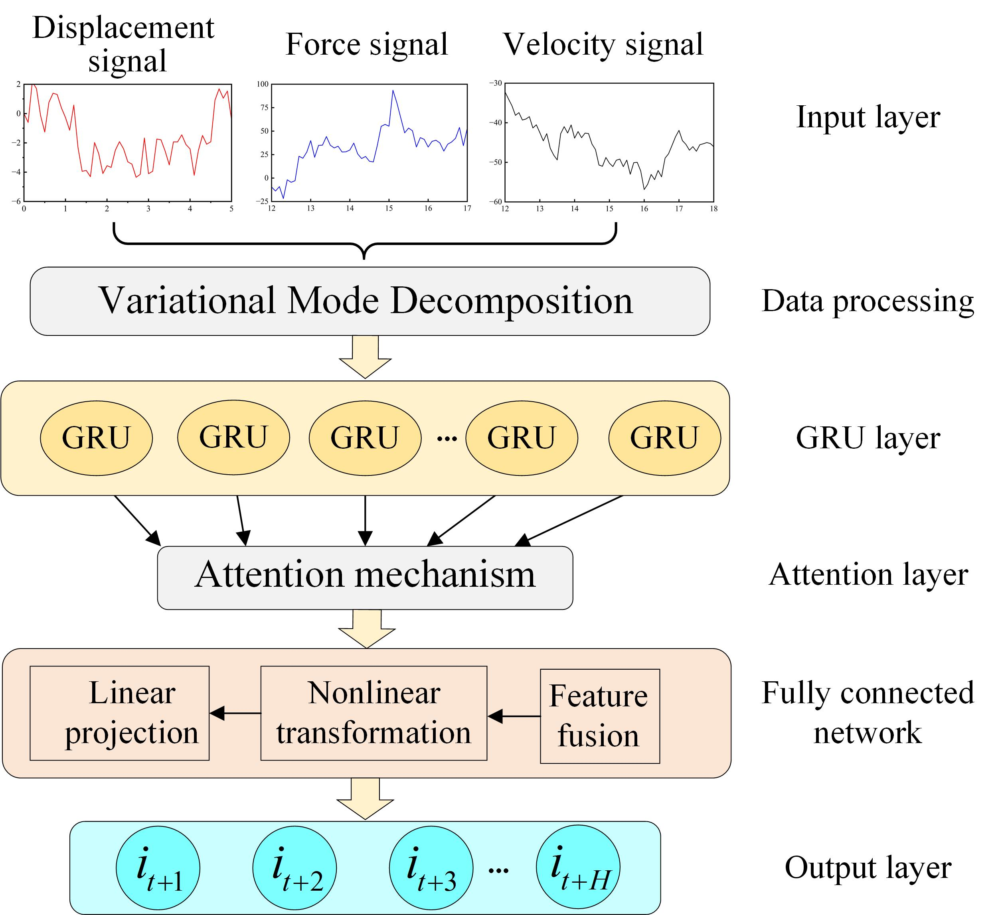
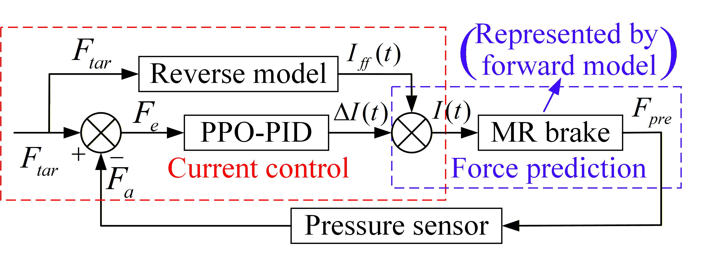

<h1 align="center">
High-Precision Force Feedback Control Method for MR Brakes Based on Improved GRU and Bouc–Wen Models
</h1>

<p align="center">
Dapeng Chen, Zhenjie Ma, Haojun Ni, Zhong Wei, Hui Zhang, Xuhui Hu, Jia Liu, and Aiguo Song<br>
Nanjing University of Information Science and Technology
</p>

---

<h2 align="center">ABSTRACT</h2>
Magnetorheological (MR) brakes, known for their compact, low-power, and safe characteristics, are widely used to provide passive force feedback in haptic interactions. However, due to hysteresis, temperature drift, and environmental disturbances, MR brakes often suffer from inaccurate output force. To enable the MR brakes to output interactive force quickly, accurately, and stably, we propose a composite force feedback control framework integrating forward modeling and inverse mapping. First, an improved Fractional Asymmetric Bouc-Wen (FABW) forward model was developed to address hysteresis and rate-dependent characteristics. This model accurately characterizes MR brake dynamics by incorporating fractional-order memory terms, tanh asymmetric corrections, and disturbance compensation. To solve the inverse model, we then propose an inverse mapping based on an enhanced Gated Recurrent Unit (GRU), which provides low-latency and high-precision force-to-current mapping. Finally, to mitigate residual errors caused by time-varying nonlinearities and drive delays, we design a PID controller combined with a near-end strategy optimization algorithm. Experimental results show that the proposed FABW forward model significantly reduces prediction errors, while the inverse model achieves a current prediction RMSE of 0.038 A. The system's force tracking error in virtual grasping tasks is only 0.052 N, effectively enhancing the realism and immersion of haptic interaction.


## Method Overview

This project proposes a high-precision force feedback control framework for magnetorheological (MR) brakes by integrating a physics-informed forward model and a data-driven inverse model.

The overall control pipeline consists of three key components:

1. **Forward Model (FABW)**  
   An improved Fractional Asymmetric Bouc–Wen (FABW) model is developed to accurately characterize the hysteresis, rate-dependence, and asymmetry of MR brakes under varying operating conditions.

2. **Inverse Model (VMD-GRU-Attention)**  
   A data-driven inverse model based on Variational Mode Decomposition (VMD), Gated Recurrent Unit (GRU), and Attention mechanism is designed to map the desired force to the required excitation current with low latency. The overall structure of the inverse model is shown below.
<p align="center">
  
</p>

3. **Closed-loop Compensation (PPO-PID)**  
   A PPO-optimized PID controller compensates modeling errors and disturbances, ensuring robust and accurate force tracking in real-time interaction tasks.The flowchart of the compound control algorithm for the MR brake is shown below.
<p align="center">
  
</p>

<h3 align="center">IMPLEMENTATION DETAILS</h3>

## Environment Setup

Configure necessary environment packages based on `requirements.txt`.


## Parameter path setting
Enter `configs/configs.py` to adjust the path of the data file.
```bash
configs/configs.py
```


## DATASET
The dataset we used was derived from an experiment platform of a direct-acting magnetorheological (MR) brake independently developed by us. By setting up a complete mechanical test and control system, dynamic response data of the input current and output force of the MR brake under different displacement and speed conditions were collected and used as the training and test sets for the model. The partially collected current and output force data can be viewed in `force_control_dataset.csv`.

## Data Preparation
Start by running `utils/data_deal.py` to retrieve and organize the required original dataset.
```bash
utils/data_deal.py
```
Then run `utils/dataprocess.py`, align the excel data by file name and merge it into a csv file. Crop the data before and after and save it as a standardized result.
```bash
utils/dataprocess.py
```

## Model Training
Adjust "args. is_training==1" in `configs/configs.py`, and use `main.py` to train the model. Adjust parameters such as epoch and batch_2 according to the training environment.
```bash
main.py
```

## Testing
Adjust "args. is_training==2" in `configs/configs.py`, and use `main.py` to validate results on the test set.


## Note:
A detailed introduction to the force feedback glove used in Fig. 11 can be found in https://www.sciencedirect.com/science/article/pii/S0924424726000658.


